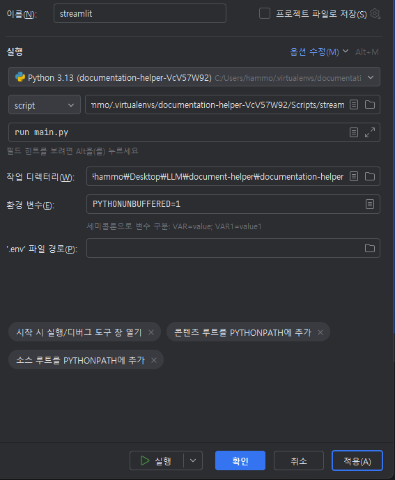

## 사용된 기술 스택
Front : Streamlit

Server : LangChain

DB(VerctorDB) : Pinecone

## 필요한 환경변수
`PINECONE_API_KEY`
`OPENAI_API_KEY`

## 필요한 의존성(패키지)
PipFile에 정의된 패키지를 설치합니다

```bash
  pip install pipenv
```

## Streamlit 관련 설정


스크립트 부문에 which streamlit을 입력하여 Streamlit이 설치된 경로를 확인하고 기입한다
```bash
  which streamlit
```